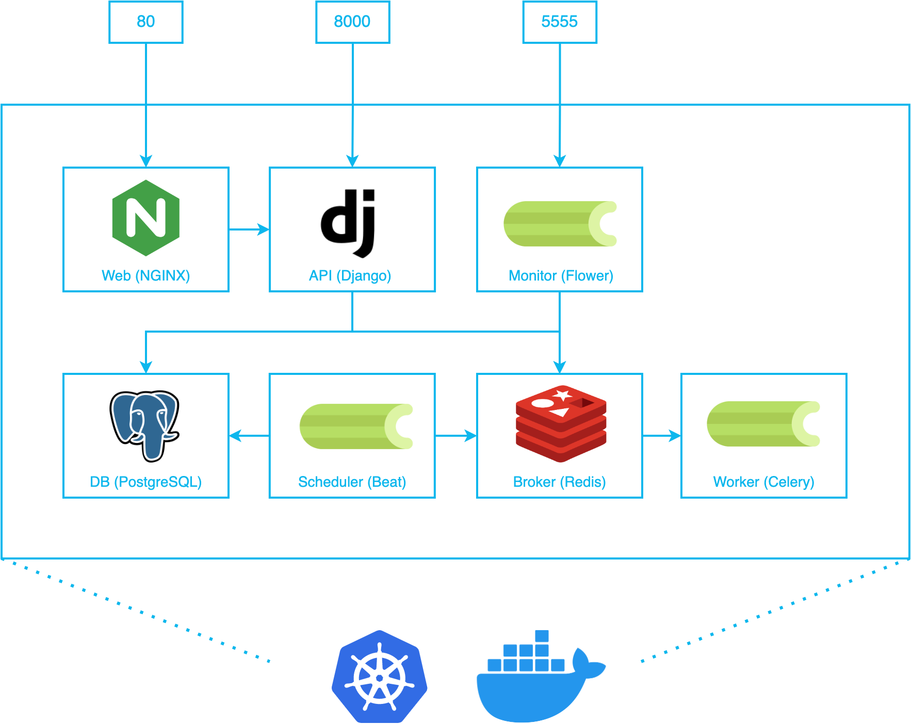

AAOS is built with [Django REST Framework] and [Celery - Distributed Task Queue] with [Flower] and [django-celery-beat]. It's using [Postgres] as DB, [Redis] as broker and [NGINX] to server the static files. 

[Django REST Framework]: https://www.django-rest-framework.org/
[Celery - Distributed Task Queue]: https://docs.celeryq.dev/
[Flower]: https://flower.readthedocs.io/en/latest/
[django-celery-beat]: https://django-celery-beat.readthedocs.io/en/latest/
[Postgres]: https://www.postgresql.org/
[Redis]: https://redis.com/
[NGINX]: https://nginx.org/

